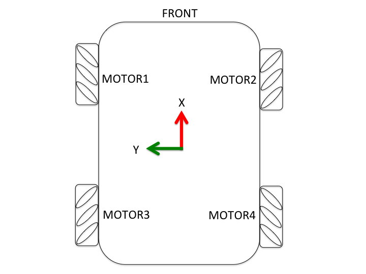
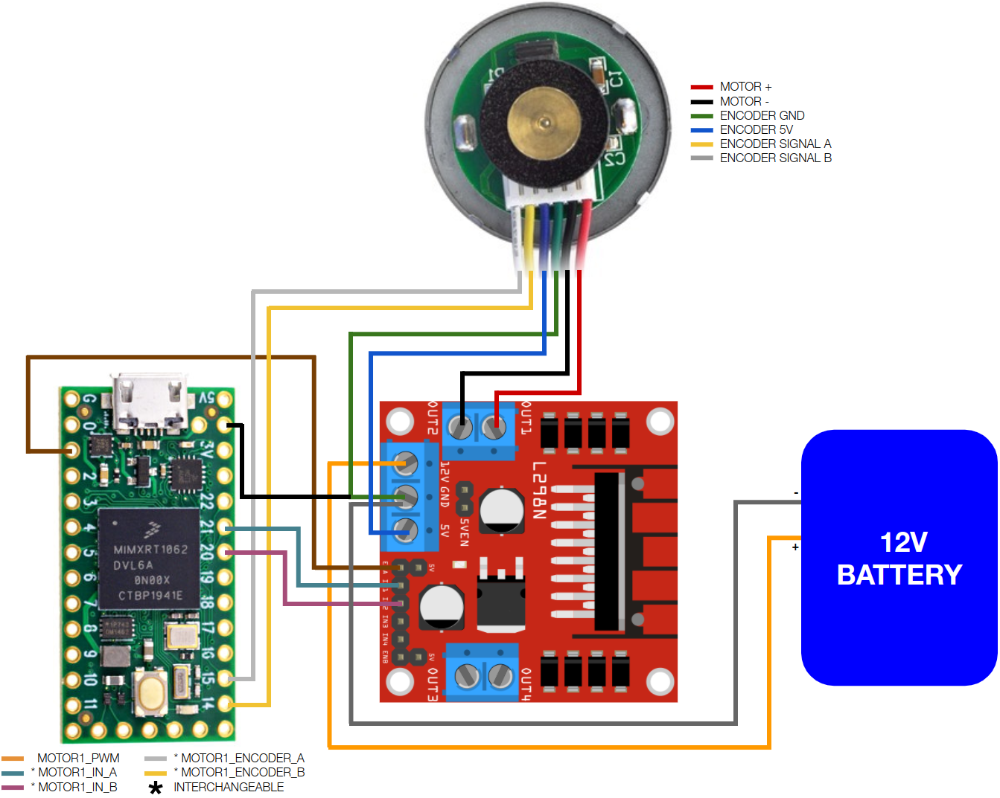
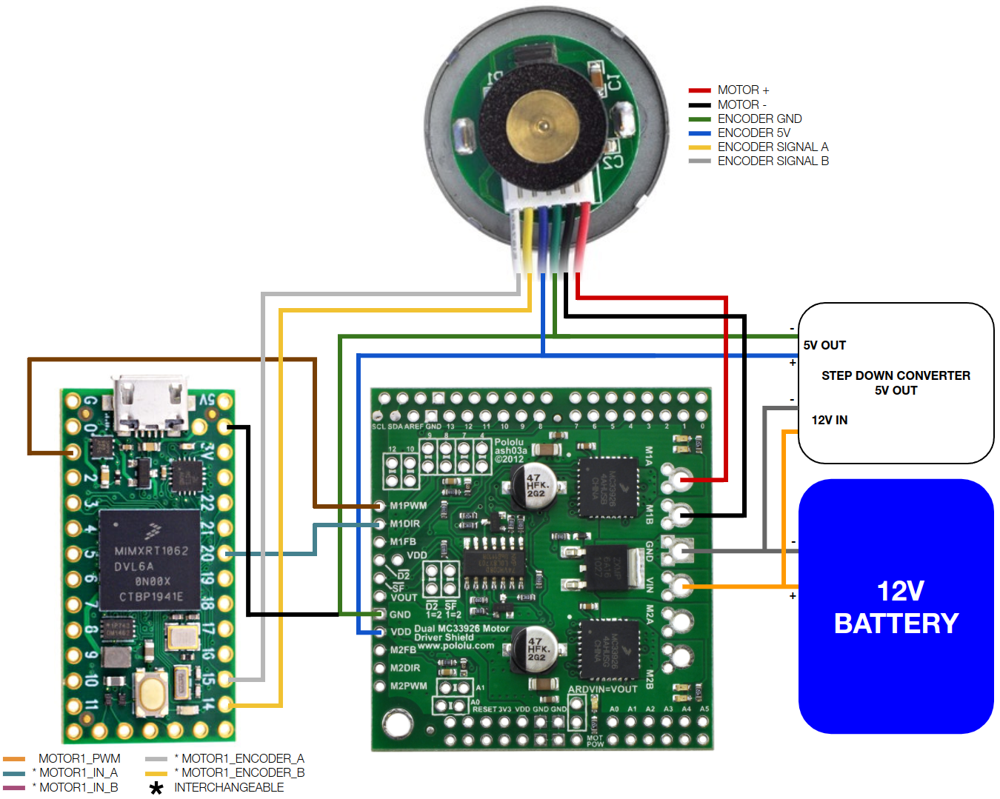
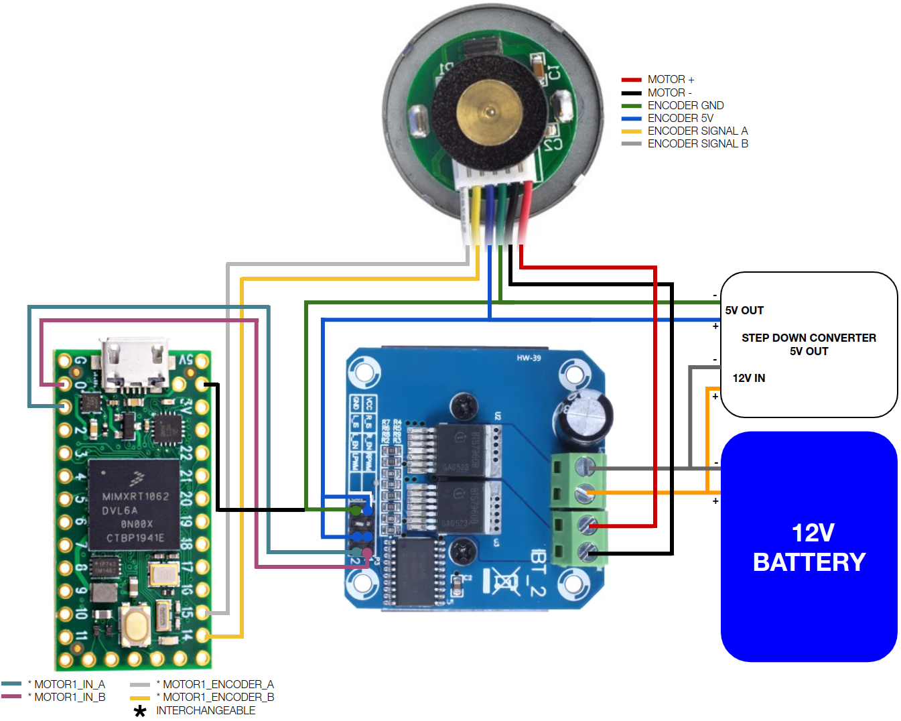
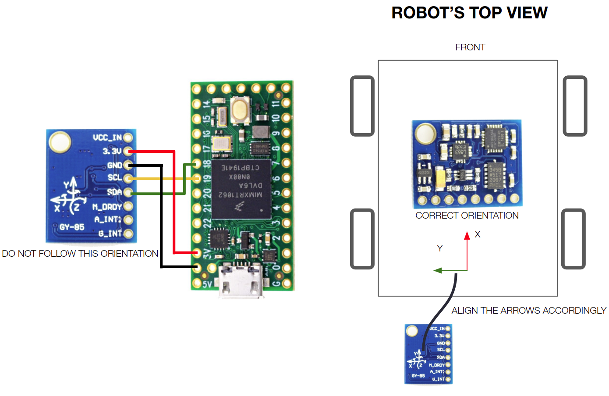
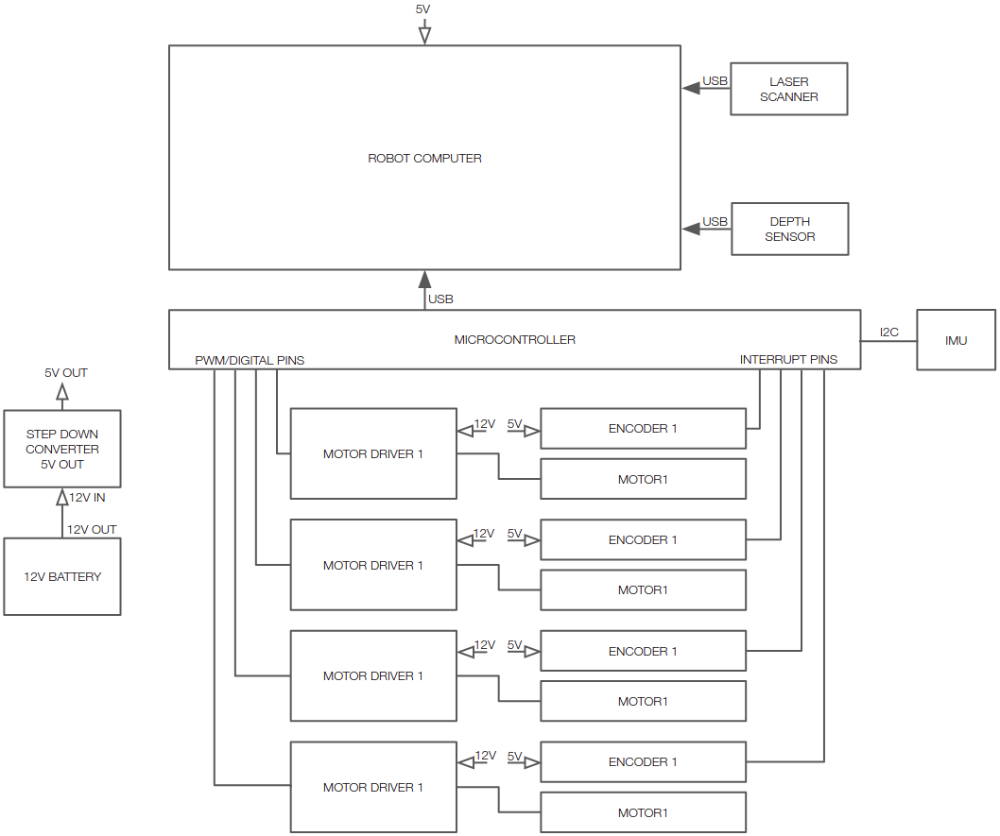
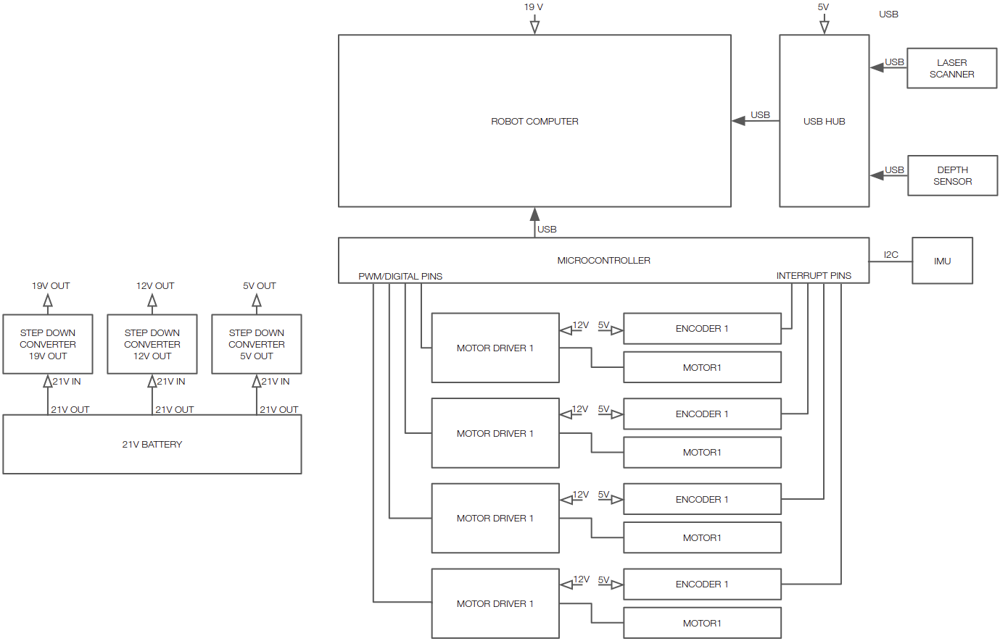

## Installation
All software mentioned in this guide must be installed on the robot computer.

### 1. Installing ROS2 and micro-ROS in the host computer

#### 1.1 ROS2 Installation

You can use the script found in [ros2me](https://github.com/linorobot/ros2me) to install ROS2 - Foxy. Take note that this project only works on ROS Foxy and above.

    git clone https://github.com/linorobot/ros2me
    cd ros2me
    ./install

You'll also need the teleoperation package to control the robot manually. Install ROS2's teleop_twist_keyboard package:

    sudo apt install ros-foxy-teleop-twist-keyboard 

#### 1.2 micro-ROS Installation

Source your ROS2 distro and workspace:

    source /opt/ros/<your_ros_distro>/setup.bash
    cd <your_ws>
    colcon build
    source install/local_setup.bash

Download and install micro-ROS:

    cd <your_ws>
    git clone -b $ROS_DISTRO https://github.com/micro-ROS/micro_ros_setup.git src/micro_ros_setup
    sudo apt install python3-vcstool
    sudo apt update && rosdep update
    rosdep install --from-path src --ignore-src -y
    colcon build
    source install/local_setup.bash

Setup micro-ROS agent:

    ros2 run micro_ros_setup create_agent_ws.sh
    ros2 run micro_ros_setup build_agent.sh
    source install/local_setup.bash

### 1. ROS2 and linorobot2 installation (ignore this for now this is just a placeholder)
It is assumed that you already have ROS2 and linorobot2 package installed. If you haven't, go to [linorobot2](https://github.com/linorobot/linorobot2) package for installation guide.

### 2. Install PlatformIO
Download and install platformio. [Platformio](https://platformio.org/) allows you to develop, configure, and upload the firmware without the Arduino IDE. This means that you can upload the firmware remotely which is ideal on headless setup especially when all components have already been fixed. 
    
    python3 -c "$(curl -fsSL https://raw.githubusercontent.com/platformio/platformio/master/scripts/get-platformio.py)"

Add platformio to your $PATH:

    echo "PATH=\"\$PATH:\$HOME/.platformio/penv/bin\"" >> ~/.bashrc

### 3. UDEV Rule
Download the udev rules from Teensy's website:

    wget https://www.pjrc.com/teensy/00-teensy.rules

and copy the file to /etc/udev/rules.d :

    sudo cp 00-teensy.rules /etc/udev/rules.d/

### 4. Install Screen Terminal

    sudo apt install screen

## Building the robot

### 1. Robot orientation
Robot Orientation:

-------------FRONT-------------

WHEEL1 WHEEL2 (2WD)

WHEEL3 WHEEL4 (4WD)

--------------BACK--------------

If you're building a 2 wheel drive robot, assign `MOTOR1` and `MOTOR2` to the left and right motors respectively.

For mecanum robots, follow the wheels' orientation below.

### 2. Motor Drivers

Supported Motor Drivers:

- **GENERIC_2_IN_MOTOR_DRIVER** - Motor drivers that have EN (pwm) pin, and 2 direction pins (usually DIRA, DIRB pins). Example: L298 Breakout boards.

- **GENERIC_1_IN_MOTOR_DRIVER** - Motor drivers that have EN (pwm) pin, and 1 direction pin (usual DIR pin). These drivers usually have logic gates included to lessen the pins required in controlling the driver. Example: Pololu MC33926 Motor Driver Shield.

- **BTS7960_MOTOR_DRIVER** - BTS7960 motor driver.

- **ESC_MOTOR_DRIVER** - Bi-directional (forward/reverse) electronic speed controllers.

The motor drivers are configurable from the config file explained in the later part of this document.

### 3. Interial Measurement Unit (IMU)

Supported IMUs:

- **GY-85**
- **MPU6050**
- **MPU9150**
- **MPU9250**

### 4. Connection Diagram
Below are connection diagrams you can follow for each supported motor driver and IMU. For simplicity, only one motor connection is provided but the same diagram can be used to connect the rest of the motors. You are free to decide which microcontroller pin to use just ensure that the following are met:

- Reserve SCL0 and SDA0 (pins 18 and 19 on Teensy boards) for IMU.

- When connecting motor driver's EN/PWM pin, ensure that the microcontroller pin used is PWM enabled. You can checkout PJRC [pinout page](https://www.pjrc.com/teensy/pinout.html) for more info.

Alternatively, you can also use the pre-defined pin assignments in lino_base_config.h. Teensy 3.x and 4.x have different mapping of PWM pins, read the notes beside each pin assignment in [lino_base_config.h](https://github.com/linorobot/linorobot2_hardware/blob/master/config/lino_base_config.h#L112) carefully to avoid connecting your driver's PWM pin to a non PWM pin on Teensy. 

All diagrams below are based on Teensy 4.0 microcontroller and GY85 IMU. Click the images for higher resolution.

#### 4.1 GENERIC 2 IN

#### 4.2 GENERIC 1 IN

#### 4.3 BTS7960

#### 4.4 IMU

Take note of the IMU's correct orientation when mounted on the robot. Ensure that the IMU's axes are facing the correct direction:

- **X** - Front
- **Y** - Left
- **Z** - Up

#### 4.5 System Diagram
Reference designs you can follow in building your robot.

A minimal setup with a 5V powered robot computer.

A more advanced setup up with a 19V powered computer and USB hub connected to sensors.

For bigger robots, you can add an emergency switch in between the motor drivers' power supply and motor drivers.

## Setting up the firmware
### 1. Robot Settings
Go to config folder and open lino_base_config.h. Uncomment the base, motor driver and IMU you want to use for your robot. For example:

    #define LINO_BASE DIFFERENTIAL_DRIVE
    #define USE_GENERIC_2_IN_MOTOR_DRIVER
    #define USE_GY85_IMU

Constants' Meaning:

*ROBOT TYPE (LINO_BASE)*
- **DIFFERENTIAL_DRIVE** - 2 wheel drive or tracked robots w/ 2 motors.

- **SKID_STEER** - 4 wheel drive robots.

- **MECANUM** - 4 wheel drive robots using mecanum wheels.

*MOTOR DRIVERS*
- **USE_GENERIC_2_IN_MOTOR_DRIVER** - Motor drivers that have EN (pwm) pin, and 2 direction pins (usually DIRA, DIRB pins).

- **USE_GENERIC_1_IN_MOTOR_DRIVER** - Motor drivers that have EN (pwm) pin, and 1 direction pin (usual DIR pin). These drivers usually have logic gates included to lessen the pins required in controlling the driver.

- **USE_BTS7960_MOTOR_DRIVER** - BTS7960 motor driver.

- **USE_ESC_MOTOR_DRIVER** - Bi-directional (forward/reverse) electronic speed controllers.

*INERTIAL MEASUREMENT UNIT (IMU)*
- **USE_GY85_IMU** - GY-85 IMUs.

- **USE_MPU6050_IMU** - MPU6060 IMUs.

- **USE_MPU9150_IMU** - MPU9150 IMUs.

- **USE_MPU9250_IMU** - MPU9250 IMUs.

Next, fill in the robot settings accordingly:

    #define K_P 0.6
    #define K_I 0.8
    #define K_D 0.5

    #define MOTOR_MAX_RPM 100             
    #define MAX_RPM_RATIO 0.85          
    #define MOTOR_OPERATING_VOLTAGE 24
    #define MOTOR_POWER_MAX_VOLTAGE 12
    #define MOTOR_POWER_MEASURED_VOLTAGE 11.7

    #define COUNTS_PER_REV1 2200    
    #define COUNTS_PER_REV2 2200      
    #define COUNTS_PER_REV3 2200      
    #define COUNTS_PER_REV4 2200      
  
    #define WHEEL_DIAMETER 0.09  
    #define LR_WHEELS_DISTANCE 0.2  

    #define PWM_BITS 10
    #define PWM_FREQUENCY 20000

Constants' Meaning:

- **K_P, K_I, K_D** - [PID](https://en.wikipedia.org/wiki/PID_controller) constants used to translate the robot's target velocity to motor speed. These values would likely work on your build, change these only if you experience jittery motions from the robot or you'd want to fine-tune it further.

- **MOTOR_MAX_RPM** - Motor's maximum number of rotations it can do in a minute specified by the manufacturer.

- **MAX_RPM_RATIO** - Percentage of the motor's maximum RPM that the robot is allowed to move. This parameter ensures that the user-defined velocity will not be more than or equal the motor's max RPM, allowing the PID to have ample space to add/substract RPM values to reach the target velocity. For instance, if your motor's maximum velocity is 0.5 m/s with `MAX_RPM_RATIO` set to 0.85, and you asked the robot to move at 0.5 m/s, the robot's maximum velocity will be capped at 0.425 m/s (0.85 * 0.5m/s). You can set this parameter to 1.0 if your wheels can spin way more than your operational speed.

    Wheel velocity can be computed as:  MAX_WHEEL_VELOCITY = (`MOTOR_MAX_RPM` / 60.0) * PI * `WHEEL_DIAMETER` 

- **MOTOR_OPERATING_VOLTAGE** - Motor's operating voltage specified by the manufacturer (usually 5V/6V, 12V, 24V, 48V). This parameter is used to calculate the motor encoder's `COUNTS_PER_REV` constant during calibration and actual maximum RPM of the motors. For instance, a robot with `MOTOR_OPERATING_VOLTAGE` of 24V with a `MOTOR_POWER_MAX_VOLTAGE` of 12V, will only have half of the manufacturer's specified maximum RPM ((`MOTOR_POWER_MAX_VOLTAGE` / `MOTOR_OPERATING_VOLTAGE`) * `MOTOR_MAX_RPM`). 

- **MOTOR_POWER_MAX_VOLTAGE** - Maximum voltage of the motor's power source. This parameter is used to calculate the actual maximum RPM of the motors.

- **MOTOR_POWER_MEASURED_VOLTAGE** - Measured voltage of the motor's power source. If you don't have a multimeter, it's best to fully charge your battery and set this parameter to your motor's operating voltage (`MOTOR_OPERATING_VOLTAGE`). This parameter is used to calculate the motor encoder's `COUNTS_PER_REV` constant. You can ignore this if you're using the manufacturer's specified counts per rev.

- **COUNTS_PER_REVX** - The total number of pulses the encoder has to read to be considered as one revolution. You can either use the manufacturer's specification or the calibrated value in the next step. If you're planning to use the calibrated value, ensure that you have defined the correct values for `MOTOR_OPERATING_VOLTAGE` and `MOTOR_POWER_MEASURED_VOLTAGE`.

- **WHEEL_DIAMETER** - Diameter of the wheels in meters.

- **LR_WHEELS_DISTANCE** - The distance between the center of left and right wheels in meters.

- **PWM_BITS** - Number of bits in generating the PWM signal. You can use the defualt value if you're unsure what to put here. More info [here](https://www.pjrc.com/teensy/td_pulse.html).

- **PWM_FREQUENCY** - Frequency of the PWM signals used to control the motor drivers. You can use the defualt value if you're unsure what to put here. More info [here](https://www.pjrc.com/teensy/td_pulse.html).

### 2. Hardware Pin Assignments
Remember to only modify the pin assignments under the motor driver constant that you are using ie. `#ifdef USE_GENERIC_2_IN_MOTOR_DRIVER`. You can checkout PJRC [pinout page](https://www.pjrc.com/teensy/pinout.html) for each board's pin layout.

The pin assignments found in lino_base_config.h are based on Linorobot's PCB board. You can wire up your electronic components based on the default pin assignments but you're also free to modify it depending on your setup. Just ensure that you're connecting MOTORX_PWM pins to a PWM enabled pin on the microcontroller and reserve SCL and SDA pins for the IMU, and pin 13 (built-in LED) for debugging.

    // INVERT ENCODER COUNTS
    #define MOTOR1_ENCODER_INV false 
    #define MOTOR2_ENCODER_INV false 
    #define MOTOR3_ENCODER_INV false 
    #define MOTOR4_ENCODER_INV false 

    // INVERT MOTOR DIRECTIONS
    #define MOTOR1_INV false
    #define MOTOR2_INV false
    #define MOTOR3_INV false
    #define MOTOR4_INV false

    // ENCODER PINS
    #define MOTOR1_ENCODER_A 14
    #define MOTOR1_ENCODER_B 15 

    #define MOTOR2_ENCODER_A 11
    #define MOTOR2_ENCODER_B 12 

    #define MOTOR3_ENCODER_A 17
    #define MOTOR3_ENCODER_B 16 

    #define MOTOR4_ENCODER_A 9
    #define MOTOR4_ENCODER_B 10

    // MOTOR PINS
    #ifdef USE_GENERIC_2_IN_MOTOR_DRIVER
        #define MOTOR1_PWM 21 //Pin no 21 is not a PWM pin on Teensy 4.x, you can swap it with pin no 1 instead.
        #define MOTOR1_IN_A 20
        #define MOTOR1_IN_B 1 

        #define MOTOR2_PWM 5
        #define MOTOR2_IN_A 6
        #define MOTOR2_IN_B 8

        #define MOTOR3_PWM 22
        #define MOTOR3_IN_A 23
        #define MOTOR3_IN_B 0

        #define MOTOR4_PWM 4
        #define MOTOR4_IN_A 3
        #define MOTOR4_IN_B 2

        #define PWM_MAX pow(2, PWM_BITS) - 1
        #define PWM_MIN -PWM_MAX
    #endif  

Constants' Meaning:

- **MOTORX_ENCODER_A** - Microcontroller pin that is connected to the first read pin of the motor encoder. This pin is usually labelled as A pin on the motor encoder board.

- **MOTORX_ENCODER_B** - Microcontroller pin that is connected to the second read pin of the motor encoder. This pin is usually labelled as B pin on the motor encoder board.

- **MOTORX_ENCODER_INV** - Flag used to change the sign of the encoder value. More on that later.

- **MOTORX_PWM** - Microcontroller pin that is connected to the PWM pin of the motor driver. This pin is usually labelled as EN or ENABLE pin on the motor driver board. 

- **MOTORX_IN_A** - Microcontroller pin that is connected to one of the motor driver's direction pin. This pin is usually labelled as DIRA or DIR1 pin on the motor driver board. On BTS7960 driver, this is one of the two PWM pins connected to the driver (RPWM/LPWM).

- **MOTORX_IN_B** - Microcontroller pin that is connected to one of the motor driver's direction pin. This pin is usually labelled as DIRB or DIR2 pin on the motor driver board. On BTS7960 driver, this is one of the two PWM pins connected to the driver (RPWM/LPWM).

- **MOTORX_INV** - Flag used to invert the direction of the motor. More on that later.

## Calibration
Before proceeding, **ensure that your robot is elevated and the wheels aren't touching the ground**. 
5.1
### 1. Motor Check
Go to calibration folder and upload the firmware:

    cd linorobot2_hardware/calibration
    pio run --target upload -e <your_teensy_board>

Available Teensy boards:
- teensy31
- teensy35
- teensy36
- teensy40
- teensy41

Some Linux machines might encounter a problem related to libusb. If so, install libusb-dev:

    sudo apt install libusb-dev

Start spinning the motors by running:
    
    screen /dev/ttyACM0

On the terminal type `spin` and press the enter key.

The wheels will spin one by one for 10 seconds from Motor1 to Motor4. Check if each wheel's direction is spinning **forward** and take note of the motors that are spinning in the opposite direction. Set MOTORX_INV constant in [lino_base_config.h](https://github.com/linorobot/linorobot2_hardware/blob/master/config/lino_base_config.h#L71-L74) to `true` to invert the motor's direction. Reupload the calibration firmware once you're done. Press `Ctrl` + `a` + `d` to exit the screen terminal.

    cd linorobot2_hardware/calibration
    pio run --target upload -e <your_teensy_board>

### 2. Encoder Check

Open your terminal and run:

    screen /dev/ttyACM0

Type `sample` and press the enter key. Verify if all the wheels are spinning **forward**. Redo the previous step if there are motors still spinning in the opposite direction.

You'll see a summary of the total encoder readings and counts per revolution after the motors have been sampled. If you see any negative number in the MOTOR ENCODER READINGS section, invert the encoder pin by setting `MOTORX_ENCODER_INV` in [lino_base_config.h](https://github.com/linorobot/linorobot2_hardware/blob/master/config/lino_base_config.h#L65-L68) to `true`. Reupload the calibration firmware to check if the encoder pins have been reconfigured properly:

    cd linorobot2_hardware/calibration
    pio run --target upload -e <your_teensy_board>
    screen /dev/ttyACM0

Type `sample` and press the enter key. Verify if all encoder values are now **positive**. Redo this step if you missed out any.

### 3. Counts Per Revolution

On the previous instruction where you check the encoder reads for each motor, you'll see that there's also COUNTES PER REVOLUTION values printed on the screen. If you have defined `MOTOR_OPERATING_VOLTAGE` and `MOTOR_POWER_MEASURED_VOLTAGE`, you can assign these values to `COUNTS_PER_REVX` constants in [lino_base_config.h](https://github.com/linorobot/linorobot2_hardware/blob/master/config/lino_base_config.h#L55-L58) to have a more accurate model of the encoder.

## Upload the firmware
Ensure that the robot pass all the requirements before uploading the firmware:

- Defined the correct motor rpm.
- Motors' IDs are correct.
- Motors spin in the right direction.
- Encoders' sign are correct.
- Defined the correct encoder's COUNTS_PER_REV.
- Defined the correct robot type.
- Defined the correct motor driver.
- Defined the correct IMU.
- Defined the correct wheel diameter.
- Defined the correct distance between wheels.

Run:

    cd linorobot2_hardware/firmware
    pio run --target upload -e <your_teensy_board>

## Testing the robot

### 1. Run the micro-ROS agent.

This will allow the robot to receive Twist messages to control the robot, and publish odometry and IMU data straight from the microcontroller. Compared to Linorobot's ROS1 version, the odometry and IMU data published from the microcontroller use standard ROS2 messages and do not require any relay nodes to reconstruct the data to complete [sensor_msgs/Imu](http://docs.ros.org/en/noetic/api/sensor_msgs/html/msg/Imu.html) and [nav_msgs/Odometry](http://docs.ros.org/en/noetic/api/nav_msgs/html/msg/Odometry.html) messages.

Run the agent:

    ros2 run micro_ros_agent micro_ros_agent serial --dev /dev/ttyACM0

### 2. Drive around

Run teleop_twist_keyboard package and follow the instructions on the terminal on how to drive the robot:

    ros2 run teleop_twist_keyboard teleop_twist_keyboard 

### 3. Check the topics

Check if the odom and IMU data are published:

    ros2 topic list

Now you should see the following topics:

    /cmd_vel
    /imu/data
    /odom/unfiltered
    /parameter_events
    /rosout

Echo odometry data:

    ros2 topic echo /odom/unfiltered

Echo IMU data:

    ros2 topic echo /imu/data

## URDF
Once the hardware is done, you can go back to [linorobot2](https://github.com/linorobot/linorobot2#urdf) package and start defining the robot's URDF.

## Troubleshooting Guide

### 1. One of my motor's not spinning.
- Check if the motors are powered.
- Check if you have a bad wiring.
- Check if you have misconfigured the motor's pin assignment in lino_base_config.h.
- Check if you uncommented the correct motor driver (ie. `USE_GENERIC_2_IN_MOTOR_DRIVER`)
- Check if you assigned the motor driver pins under the correct motor driver constant. For instance, if you uncommented `USE_GENERIC_2_IN_MOTOR_DRIVER`, all the pins you assigned must be inside the `ifdef USE_GENERIC_2_IN_MOTOR_DRIVER` macro.

### 2. Wrong wheel is spinning during calibration process
- Check if the motor drivers have been connected to the correct microcontroller pin.
- Check if you have misconfigured the motor's pin assignment in lino_base_config.h.

### 3 One of my encoder has no reading (0 value).
- Check if the encoders are powered.
- Check if you have a bad wiring.
- Check if you have misconfigured the encoder's pin assignment in lino_base_config.h.

### 4. Nothing's printing when I run the screen app.
- Check if you're passing the correct serial port. Run:

        ls /dev/ttyACM*
    
    and ensure that the available serial port matches the port you're passing to the screen app.

- Check if you forgot to [copy the udev rule](https://github.com/linorobot/linorobot2_hardware#3-udev-rule):

        ls /etc/udev/rules.d/00-teensy.rules 

    Remember to restart your computer if you just copied the udev rule.

### 5. The firmware was uploaded but nothing's happening.
- Check if you're assigning the correct Teensy board when uploading the firmware. If you're unsure which Teensy board you're using, take a look at the label on the biggest chip found in your Teensy board and compare it with the boards shown on PJRC's [website](https://www.pjrc.com/teensy/).
